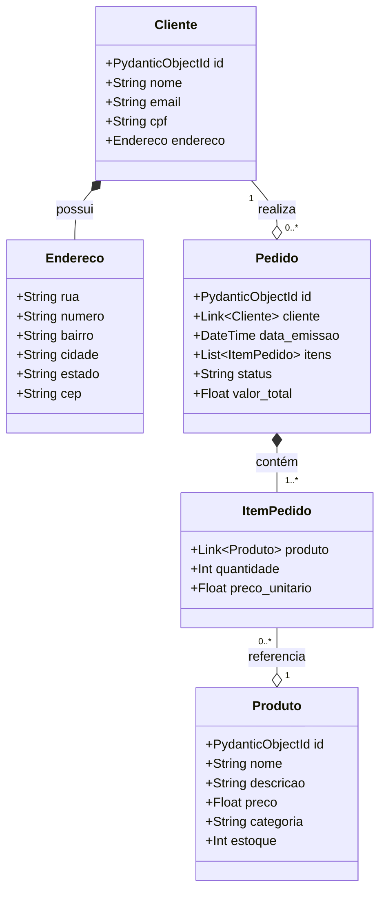

# API FastAPI com Beanie (MongoDB)

Este projeto implementa uma API RESTful utilizando **FastAPI** como framework web e **Beanie** como ODM (Object-Document Mapper) para MongoDB.

## 📋 Funcionalidades

- CRUD completo para **Clientes**, **Produtos** e **Pedidos**
- Paginação em todos os endpoints de listagem
- Relacionamentos entre entidades usando Links do Beanie
- Validação de dados com Pydantic
- Busca e filtros avançados

## 🛠️ Tecnologias

- Python 3.11+
- FastAPI
- Beanie (ODM para MongoDB)
- Pydantic v2
- Motor (Driver assíncrono MongoDB)

## 📊 Diagrama de Classes



## 🚀 Como Executar

### 1. Clone o repositório
```bash
git clone <url-do-repositorio>
cd Trabalho3DPersistencia
```

### 2. Crie e ative um ambiente virtual
```bash
python -m venv .venv
```

**Ativar no Windows (PowerShell):**
```powershell
.venv\Scripts\Activate.ps1
```

**Ativar no Windows (CMD):**
```cmd
.venv\Scripts\activate.bat
```

**Ativar no Linux/Mac:**
```bash
source .venv/bin/activate
```

### 3. Instale as dependências
```bash
pip install -e .
```

### 4. Configure as variáveis de ambiente
Copie o arquivo `.env.example` para `.env` e configure:

**Linux/Mac:**
```bash
cp .env.example .env
```

**Windows (PowerShell):**
```powershell
Copy-Item .env.example .env
```

### 5. Inicie o MongoDB
Certifique-se de que o MongoDB está rodando localmente na porta 27017, ou configure a URL do MongoDB Atlas no arquivo `.env`.

### 6. Execute a aplicação
Com o ambiente virtual ativado:
```bash
uvicorn app.main:app --reload
```

Ou, se preferir executar sem ativar o venv:

**Windows:**
```powershell
.venv\Scripts\python.exe -m uvicorn app.main:app --reload
```

**Linux/Mac:**
```bash
.venv/bin/python -m uvicorn app.main:app --reload
```

A API estará disponível em: http://localhost:8000

## 📚 Documentação da API

- **Swagger UI**: http://localhost:8000/docs
- **ReDoc**: http://localhost:8000/redoc

## 🔗 Endpoints Principais

### Clientes
| Método | Endpoint | Descrição |
|--------|----------|-----------|
| GET | `/clientes` | Lista clientes (paginado) |
| GET | `/clientes/{id}` | Obtém cliente por ID |
| POST | `/clientes` | Cria novo cliente |
| PUT | `/clientes/{id}` | Atualiza cliente |
| DELETE | `/clientes/{id}` | Remove cliente |

### Produtos
| Método | Endpoint | Descrição |
|--------|----------|-----------|
| GET | `/produtos` | Lista produtos (paginado) |
| GET | `/produtos/{id}` | Obtém produto por ID |
| POST | `/produtos` | Cria novo produto |
| PUT | `/produtos/{id}` | Atualiza produto |
| DELETE | `/produtos/{id}` | Remove produto |

### Pedidos
| Método | Endpoint | Descrição |
|--------|----------|-----------|
| GET | `/pedidos` | Lista pedidos (paginado) |
| GET | `/pedidos/{id}` | Obtém pedido por ID |
| GET | `/pedidos/cliente/{cliente_id}` | Lista pedidos de um cliente |
| POST | `/pedidos` | Cria novo pedido |
| PUT | `/pedidos/{id}` | Atualiza pedido |
| DELETE | `/pedidos/{id}` | Remove pedido |

## 📄 Paginação

Todos os endpoints de listagem suportam paginação através dos parâmetros:

- `page`: Número da página (padrão: 1)
- `page_size`: Itens por página (padrão: 10, máximo: 100)

Exemplo de resposta paginada:
```json
{
  "items": [...],
  "page": 1,
  "page_size": 10,
  "total_items": 50,
  "total_pages": 5
}
```

## 👥 Equipe

Veja o arquivo `Equipe.txt` para informações sobre os membros do grupo.

## 📝 Licença

Este projeto foi desenvolvido para fins acadêmicos.
